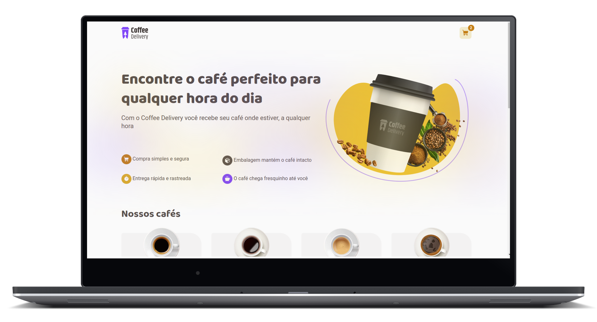
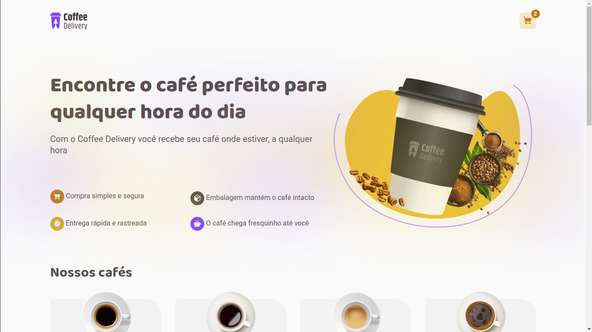
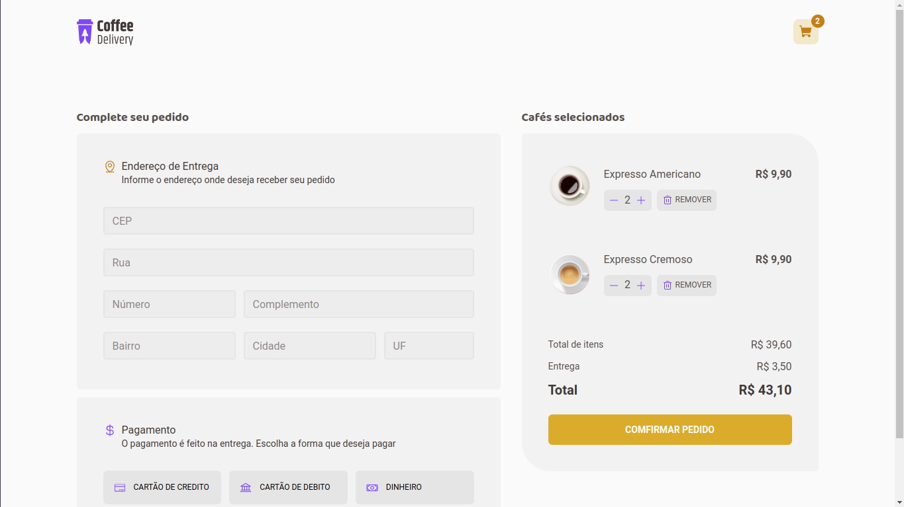
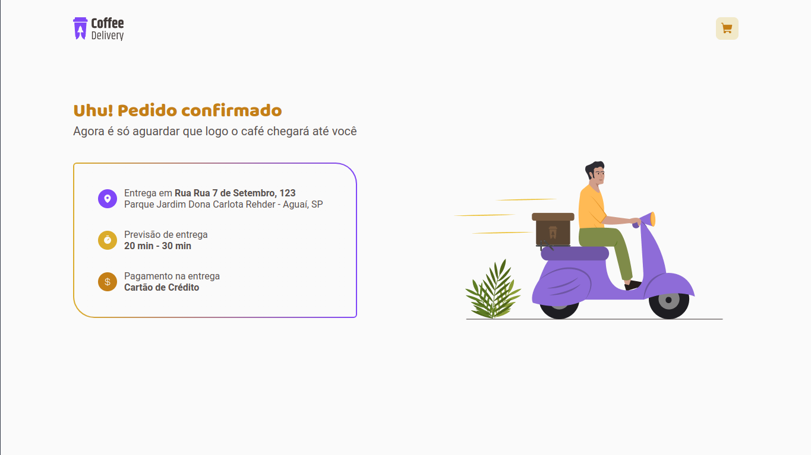

<h1 align="center">
    
</h1>

<div align="center">

[](LICENSE.md)


<br>

<p align="center">
  <strong>
      <a href="#-Preview">Preview</a> &nbsp;|&nbsp; 
  </strong>
  <strong>
      <a href="#-projeto">Projeto</a> &nbsp;|&nbsp; 
  </strong>
  <strong>
      <a href="#-layout">Layout</a> &nbsp;|&nbsp; 
  </strong>
  <strong>
      <a href="#-tecnologias">Tecnologias</a> &nbsp;|&nbsp; 
  </strong>
  <strong>
      <a href="#-como-executar-o-projeto">Executando</a> &nbsp;|&nbsp; 
  </strong>
  <strong>
      <a href="#-referências">Referências</a> &nbsp;|&nbsp; 
  </strong>
  <strong>
      <a href="#-autor">Autor</a> 
  </strong>
</p>

<p align="center">
  
</p>
</div>

## **✨ Preview**

#### Sistema Online: https://coffee-delivery-ecomerce.vercel.app

---

## **💻 Projeto**

Um projeto desenvolvido durante o <b>Bootcamp Ignite</b> da <b>Rocketseat</b>, o projeto "Coffee Delivery" é um projeto que simula um e-commerce de venda de cafés por entrega.

---

## **🔖 Layout**

Você pode visualizar o layout do projeto no formato através [desse link](<https://www.figma.com/file/cXnQ94HEjpoxl55ZtjKRiy/Coffee-Delivery-(JD)?type=design&node-id=2%3A12&mode=design&t=FEeKvDZIRfmBSa9U-1>). Lembrando que você irá precisar ter uma conta no [Figma](http://figma.com/).

#### **Web**

<p align="center">
  
  
  
</p>

---

## **💻 Tecnologias**

#### **Website** ([React][react])

- **[React][react]**
- **[Typescript][typescript]**
- **[Vite][vite]**
- **[Styled Components][styled_components]**
- **[React Hook Form][react_hook_form]**
- **[JSON Sserver][json_server]**
- **[Node v18.16.1][node]**

> \* Veja o arquivo <kbd>[package.json](./package.json)</kbd>

#### **Utilitários**

- Editor: **[Visual Studio Code][vscode]**
- Markdown: **[StackEdit][stackedit]**, **<kbd>[Markdown Emoji][markdown_emoji]</kbd>**

---

## **🚀 Como executar o projeto**

### Configurações Iniciais

Primeiro, você precisa ter o <kbd>[NodeJS](https://nodejs.org/en/download/)</kbd> instalado na sua máquina.

Se você estiver utilizando o **Linux**, você pode optar por instalar o **Node** através do gerênciador de versões <kbd>[nvm]</kbd> para caso seja nescessario alterar a sua versão do **Node** para uma versão mais antiga ou mais nova.

Você pode optar também por utilizar o **yarn** no lugar do **npm**. Você pode instalar clicando nesse <kbd>[link][yarn]</kbd>.

Após ter o **Node** instalado, instale as dependências do **React** contidas nos arquivos `package.json` que se encontram na raíz do repositório. Para instalar as dependências, basta abrir o terminal no diretório e digitar o comando:

```sh
$ npm install

# ou

$ yarn
```

> Veja a parte de **scripts {}** do arquivo <kbd>[package.json](./package.json)</kbd> para saber quais scripts estão disponíveis.

### Executando JSON Server

```sh
# Executando o JSON Server:
$ npm run server

# ou

# Executando o JSON Server:
$ yarn server
```

---

### Executando o WebSite

```sh
# Executando o website em outra aba de terminal:
$ npm run dev

# ou

# Executando o website em outra aba de terminal:
$ yarn dev
```

> Se o browser não abrir automaticamente, acesse: http://localhost:5173.

---

## **📚 Referências**

- [Blog Rocketseat](https://blog.rocketseat.com.br/)
- [ReactJS](https://reactjs.org/docs/getting-started.html) | [ReactJS pt-BR](https://pt-br.reactjs.org/docs/getting-started.html)
- [Node](https://nodejs.org/en/)

## **👨‍🚀 Autor**

<a href="https://github.com/regisfilhodev">
 
 <br />
 <sub><b>Regis Filho</b></sub></a>
 <br />

Esforçado, dedicado e apaixonado por tecnologia. Sempre explorando novas ferramentas, enfrentando desafios e buscando aprimoramento contínuo.

[](https://github.com/regisfilhodev)

## **:memo: Licença**

Esse projeto está sob a licença MIT. Veja o arquivo [LICENSE](LICENSE.md) para mais detalhes.

<!-- Website Links -->

[rocketseat_site]: https://rocketseat.com.br/

<!-- Badges -->

[repository_license_badge]: https://img.shields.io/github/license/JairoDoni/NLW-1.0
[web_react_badge]: https://img.shields.io/badge/web-react-blue
[typescript]: https://www.typescriptlang.org/pt/

<!-- Techs -->

[react]: https://reactjs.org/
[vite]: https://vitejs.dev
[styled_components]: https://styled-components.com
[zod]: https://zod.dev
[json_server]: https://github.com/typicode/json-server
[react_hook_form]: https://www.react-hook-form.com
[node]: https://nodejs.org/en/
[nvm]: https://github.com/nvm-sh/nvm
[vscode]: https://code.visualstudio.com/
[react_native]: http://www.reactnative.com/
[stackedit]: https://stackedit.io
[markdown_emoji]: https://gist.github.com/rxaviers/7360908
[react_icons]: https://react-icons.github.io/react-icons/
[typescript]: https://www.typescriptlang.org/
[asdf]: https://github.com/asdf-vm/asdf
[yarn]: https://classic.yarnpkg.com/en/docs/install/#debian-stable
[webpack]: https://webpack.js.org
